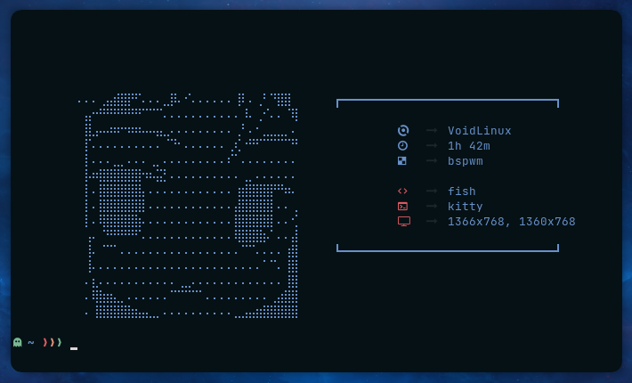

# Neofetch configuration

A simple but cooler configuration for neofetch.



## Installation

Only copy the files to `.config`:

```sh
if test -d $HOME/.config/neofetch; then mv $HOME/.config/neofetch $HOME/.config/neofetch.BAK; fi
git clone https://github.com/NightCS/neofetch.git neofetch
mv neofetch $HOME/.config
```

Done
